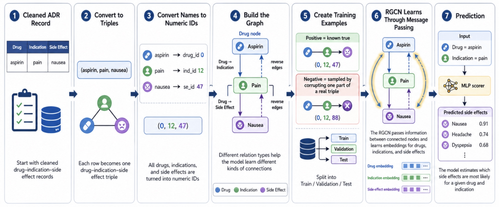

# RGCN
Using RGCN model to explore drugs related side effects 

This project uses a Relational Graph Convolutional Network (RGCN) to predict potential drug side effects based on drug–indication–side effect relationships.

## Project Overview
- Built a heterogeneous graph with drug, indication, and side effect nodes
- Trained an RGCN model for link prediction / side effect prediction
- Evaluated performance using ROC-AUC, PR-AUC, F1, precision, and recall
- Built a Streamlit demo app for interactive prediction

## Tools
Python, PyTorch, DGL/PyTorch Geometric, pandas, scikit-learn, Streamlit

## Limitations
This project is for educational and exploratory ML purposes only and is not intended for medical decision-making.

## Team & Contributions

This was a group project completed as part of an Applied Machine Learning course.

My contributions included:
- Data filtering & feature engineering
- Building the RGCN model & workflow
- Creating training progress and evaluation visualizations
- Final presentation

## Project Pipeline

## Final Presentation

[View Final Presentation PDF](Presentation/SideEffectsproject_GithubUpload.pdf)
